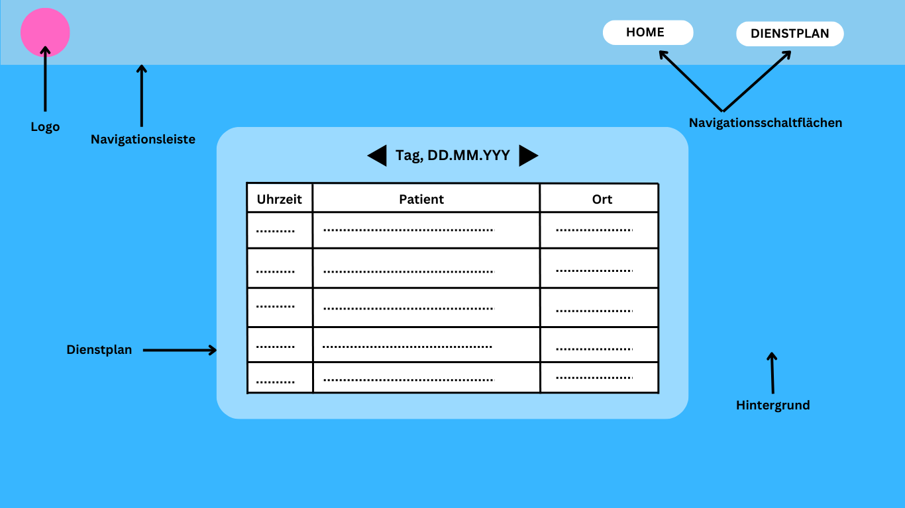
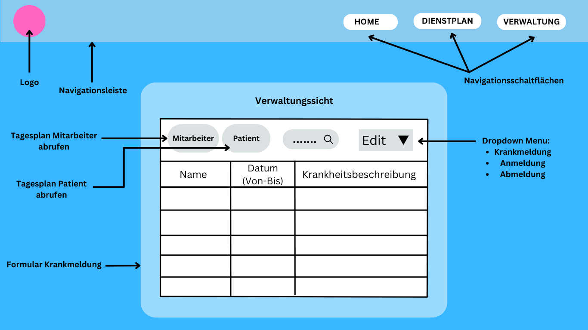

# Praktikumsbericht

## 1. Einleitung

  

  ### 1.2 Rahmenbedingungen

Die Firma "Pflege für Alle", ein mobiler Pflegedienst, der Menschen in Not pflegerische und häusliche Unterstützung bietet, hat uns gebeten, eine Software/App für sie zu entwickeln, damit sie mit dem Management Schritt halten können, das sich aus der Expansion des Unternehmens ergibt.

Ursprünglich gab es 40 Mitarbeiter, aber seit sie letztes Jahr ein weiteres Pflegeheim erworben haben, hat sich die Zahl auf etwa 60 geändert. Vor dem Erwerb konnte der Firmeninhaber Rudi Fleißig all das Management im Kopf erledigen, aber jetzt fühlt er sich überfordert von der Anzahl der Mitarbeiter und Patienten, die berücksichtigt werden müssen.

Die Software sollte den Mitarbeitern zugänglich sein und es den Pflegern ermöglichen, den Dienstplan einzusehen (der Name und Standort jedes Patienten sowie Datum und Uhrzeit enthält, zu der die Pfleger bei ihnen sein müssen), während es den Verwaltungsmitarbeitern ermöglicht, Dinge wie den Dienstplan zu verwalten, einen Mitarbeiter oder Kunden hinzuzufügen oder zu entfernen und deren Verfügbarkeit zu überprüfen.

Die Gestaltung des Programms bleibt uns überlassen.

## 2. Anforderungen

  ### 2.1 funktionale Anforderungen
  - (1) Alle Betreuer sollten ihre Tagespläne einsehen können:
        Die Pläne sollten Details wie den Namen des Klienten, den Ort, die Zeit und die Dauer des Besuchs enthalten.
        
  - (2) Die Tagespläne müssen automatisch erstellt werden:
        Die Software sollte die Verfügbarkeit der Betreuer, den Standort der Klienten und die für jeden Besuch benötigte Zeit berücksichtigen, um die Tagespläne automatisch zu erstellen.
        
  - (3) Es sollte möglich sein, neue Kunden hinzuzufügen:
        Die Software sollte es ermöglichen, neue Kundenprofile anzulegen, die Informationen enthalten wie: ob sie ambulant oder stationär sind, an welchen Tagen und wie oft am Tag sie unsere Pflegedienste benötigen.
        
  - (4) Krankenbesuche müssen während des Tages berücksichtigt werden:
        Die Software sollte in der Lage sein, die Zeitpläne in Echtzeit anzupassen, wenn sich ein Betreuer krank meldet, um sicherzustellen, dass alle Kunden weiterhin betreut werden.
        
  - (5) Es muss möglich sein, neue Mitarbeiter hinzuzufügen:
        Die Software sollte es ermöglichen, neue Mitarbeiterprofile anzulegen, die persönliche Angaben, Verfügbarkeit und Rolle enthalten.
        
  - (6) Bei ambulanten Kunden sollte die Reisezeit berücksichtigt werden:
        Die Software sollte bei der Planung von Besuchen für ambulante Kunden die Reisezeit berücksichtigen, um sicherzustellen, dass die Pflegekräfte genügend Zeit haben, um von einem Kundenort zum anderen zu gelangen.
        
  - (7) Für stationäre Klienten darf keine Reisezeit anfallen:
        Da sich die stationären Klienten in derselben Einrichtung befinden, sollte keine Reisezeit in die Terminplanung einbezogen werden.
        
  - (8) Warnung, wenn es zu wenige Betreuer für alle Klienten gibt: 
        Die Software sollte Warnungen ausgeben, wenn zu einem bestimmten Zeitpunkt nicht genügend Pflegekräfte für alle Klienten zur Verfügung stehen, damit gegebenenfalls zusätzliches Personal zugewiesen werden kann.
        
  - (9) Es sollte eine Warnung ausgegeben werden, wenn es Betreuer ohne Klienten gibt:
        Die Software sollte eine Warnung ausgeben, wenn es Pflegekräfte gibt, die zu einem bestimmten Zeitpunkt keine Kunden zu betreuen haben, so dass gegebenenfalls zusätzliche Kunden zugewiesen werden können.
        
  - (10) Die Kunden sollten mehrmals am Tag besucht werden können:
        Die Software sollte mehrere Besuche pro Tag für Kunden ermöglichen, die mehr als einen Besuch durch eine Betreuungsperson benötigen. Das Planungssystem sollte flexibel genug sein, um mehrere Besuche durch verschiedene Betreuer zu ermöglichen, wobei für jeden Besuch genügend Zeit zur Verfügung steht, um den Bedürfnissen des Kunden gerecht zu werden.
        
  - (11) Die Benutzerschnittstelle sollte einfach zu bedienen sein:
        Die Benutzeroberfläche der Software sollte benutzerfreundlich gestaltet sein, eine klare und intuitive Navigation aufweisen und nur minimalen Schulungsaufwand für neue Benutzer erfordern.
  
  ### 2.2 nichtfunktionale Anforderungen
  
  - (1) Das Programm sollte zuverlässig sein, damit es nicht abstürzt oder Daten verliert: Die Software sollte mit einer robusten Architektur und einer gut getesteten Codebasis entwickelt werden, um sicherzustellen, dass sie zuverlässig arbeitet, ohne abzustürzen oder Daten zu verlieren. Außerdem sollte sie über angemessene Datensicherungs- und Wiederherstellungsmechanismen verfügen, um sicherzustellen, dass die Daten bei einem Systemausfall oder anderen unerwarteten Ereignissen nicht verloren gehen.

  - (2) Das Programm sollte skalierbar sein, damit es im Laufe der Zeit mit einer wachsenden Zahl von Mitarbeitern und Kunden umgehen kann: Die Software sollte in der Lage sein, im Laufe der Zeit eine wachsende Zahl von Mitarbeitern und Kunden aufzunehmen, ohne die Leistung oder Stabilität zu beeinträchtigen. 

  - (3) Das Programm sollte eine Reaktionszeit von 5 Sekunden oder weniger haben, wenn es eine Aktion ausführt: Die Software sollte auf Geschwindigkeit optimiert sein, mit gut geschriebenem Code und effizienten Algorithmen, um sicherzustellen, dass sie Aktionen schnell ausführen kann. 

  - (4) Das Programm sollte sicher sein, und nur die Mitarbeiter sollten Zugang dazu haben: Die Software sollte mit starken Sicherheitsmechanismen ausgestattet sein, um unbefugten Zugriff oder Datenverstöße zu verhindern. Dies kann die Implementierung von Benutzerauthentifizierungs- und Autorisierungsmechanismen beinhalten. Darüber hinaus sollte der Zugriff auf das System nur befugten Mitarbeitern vorbehalten sein, und es sollten geeignete Zugriffskontrollen und Berechtigungen eingerichtet werden, um den Datenschutz und die Datensicherheit zu gewährleisten.

## 3. Use Case

Unterschied zu 5. Geschäftsprozesse?

## 4. Architektur

Die Software wird als Webapp entwickelt. Der Server wird mit Python und Flask entwickelt.

Server:

Genutzt wird WebFrameWork Flask mit dem Template System von JinJa und der SQL Schnittstelle Flask-SQLAlchemy

Die jeweiligen Seiten werden als Funktion aufgerufen und geben eine HTML Datei zurück

Gebraucht werden insgesamt 4 Templates:
-Die Anmeldeseite womit man dann ->
-zum Tagesplan kommt, wenn sich Mobile/Stationäre Pfleger anmelden
-oder zur Verwaltung gelangt, wenn sich der Boss, oder Büroangestellte anmelden, wie z.B. die Sekretärin ( in der Ansicht sieht man alle An/Abmeldungen, Krankschreibungen etc der Pfleger und Patienten
     -in dem 3. Template wird ein weiteres “kaskadiert” womit man  bei dem Edit Button angelangt um die jeweiligen Einträge zu editieren

Man gelangt durch einen VPN zum Intranet der Firma, alle Mitarbeiter benötigen einen VPN Clienten den man kostenlos im App Store usw. installieren kann; danach ruft man die Seite der Firma auf im Browser.
Falls im Laufe des Tages änderungen vorliegen, kümmert sich das Sekretariat darum.

## 5. Geschäftsprozesse

  ### 1. Dienstbeginn Pflegepersonal:
   - Eigenen Namen im Menü auswählen (1F) und anfangen den Tagesplan abzuarbeiten (2F).
   - Nach jedem Kunden schauen, wer der nächste Kunde ist. 
   - Wenn ein Kunde abgemeldet wird verschwindet er im Tagesplan.
   - Wenn alle Kunden abgearbeitet sind, Feierabend.
  
  ### 2. Krankmeldung eines Kunden:
   - Kunde ruft an.
   - Verwaltungsangestellte tragen Krankmeldung ein.
   - Software berücksichtigt Krankmeldung.
    
  ### 3. Neuer Angestellter:
   - Verwaltungsangestellte/Chef tragen neuen Angestellten ein.
   - Wahl der Rolle (Pfleger ambulant, Pfleger stationär, Verwaltung).
   
  ### 4. Neuer Kunde:
   - Verwaltungsangestellte/Chef tragen neuen Kunden ein.
   - Wahl ob ambulant oder stationär.
   - Wahl an welchen Tagen bedarf besteht.
   - Wahl wie oft pro Tag bedarf besteht.
  
  ### 5. Dienstbeginn Verwaltung:
   - Eigenen Namen im Menü auswählen (1F).
   - Verwaltungsansicht (3F) wird angezeigt.

## 6. Datenmodell

Link zu Bild von ER-Modell.

## 7. GUI-Design

Dies ist die erste Seite, die der Benutzer sieht, wenn er die Website besucht. Die Seite besteht aus einem Hintergrundbild/-video, mit einem einfachen, minimalistisch aussehenden Anmeldepanel in der Mitte und dem Logo des Unternehmens darüber.

Der Benutzer wird mit einer "Willkommen"-Nachricht begrüßt und dann aufgefordert, seinen Namen in einem Textfeld einzugeben, wonach er auf die Schaltfläche "OK" klickt. Durch Klicken auf die Schaltfläche wird der Benutzer je nach Rolle, die seinem Namen im Unternehmen zugeordnet ist, zu [Tagesplan](#tagesplan) oder [Verwaltungsansicht](#verwaltung) umgeleitet.

 

## 8. Klassendiagramm
